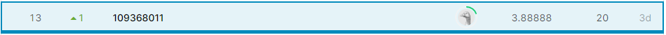

# Taiwanese-speech-recognition-109368011
Kaggle Competition page: [LINK](https://www.kaggle.com/c/deep-learning-ntut-2020-fall-ctc-taiwanese-e2e)
Rank(13/136):  


# 台語語音辨認 using End-to-End Approach
## 1.背景介紹
kaggle競賽網站:https://www.kaggle.com/c/deep-learning-ntut-2020-fall-ctc-taiwanese-e2e/overview
目標為訓練一個語音辨識之類神經網路，辨別音檔中的台語句子為何，並將辨識結果以拼音寫出。
資料中共有6584個音檔，測試集有346個音檔。 
## 2.程式作法：
使用競賽頁面中參考程式來進行修改，參考程式:https://github.com/philipperemy/tensorflow-ctc-speech-recognition.git

### STEP 1 Set train data : 
將要訓練的資料預先處理成我們要的格式:

1. 將音檔的格式轉換成 16 kHz sampling, signed-integer, 16 bits：

    
    
2. 將轉換過的音檔補0，讓每個檔名長度一樣：
    
    
      
3. 製作與音檔相對應的txt檔:
    
    導入訓練的csv檔 :  
      
    導入訓練音檔的名稱並與導入的csv檔做處理:  
      
    將處理好的資料寫成txt檔輸出 :  
      
    更名 :  
      
      
4. 將音檔與txt各自放在train的p225底下(如下):

      
### STEP 3 Train : 
調整模型並開始訓練：
1. 修改 generate_audio_cache.py中的設定 :  

    ```py
    def get_script_arguments():
    args = ArgumentParser()
    args.add_argument('--audio_dir', required=True)
    args.add_argument('--output_dir', default='cache', type=ensure_dir)
    args.add_argument('--sample_rate', default=16000, type=int)
    args.add_argument('--speakers_sub_list', default='p225')  # example: p225,p226,p227
    return args.parse_args()
    ```
    
2. 修改 ctc_tensorflow_example.py:  
    
    這邊將LSTM模型改為2層，各1024個node:
    ```py
    num_epochs = 5000
    num_hidden = 1024
    num_layer=2
    batch_size = 8
    ```
    建構LSTM模型 :  
    ```py
    inputs = tf.placeholder(tf.float32, [None, None, num_features], name='inputs')
    targets = tf.sparse_placeholder(tf.int32, name='targets')
    seq_len = tf.placeholder(tf.int32, [None], name='seq_len')

    def lstm_cell():
        lstm = tf.contrib.rnn.BasicLSTMCell(num_hidden, forget_bias=1.0)
        lstm = tf.nn.rnn_cell.DropoutWrapper(lstm,0.5)
        return lstm
    # Stacking rnn cells
    stack = tf.contrib.rnn.MultiRNNCell([lstm_cell() for _ in range(num_layer)])
    # The second output is the last state and we will no use that
    outputs, _ = tf.nn.dynamic_rnn(stack, inputs, seq_len, dtype=tf.float32)
    ```
    
    原始程式碼並無儲存模型訓練的結果，這邊自行加入儲存的程式碼，採用每100epoch存一次，以及得到更低的val_cost就存一次:  
    ```py
    if ((curr_epoch+1)%100 == 0):
    save_path = saver.save(session,'./models/checkpoint004/' + str(curr_epoch+1), global_step = curr_epoch + 1)
    print('save model to :',save_path)

    if val_cost < small_val_cost:
    small_val_cost=val_cost
    save_path = saver.save(session,'./models/checkpoint004/' + "best_val_cost", global_step = curr_epoch + 1)
    print('save model to :',save_path)
    ```

3. 輸入 python generate_audio_cache.py --audio_dir train/ 來生成訓練所需的資料
4. 輸入 python ctc_tensorflow_example.py 開始訓練，若是有多張GPU則可以輸入 CUDA_VISIBLE_DEVICES={Your GPU Number} ctc_tensorflow_example.py

### STEP 4 Test :
建立測試程式測試並將結果送到Kaggle  
1. 將要測試的資料預先處理成我們要的格式，處理過程與訓練資料的處理方式一樣，txt檔的內容可以空白 :  
    
    將音檔的格式轉換成 16 kHz sampling, signed-integer, 16 bits :  
      
    
    將轉換過的音檔補0，讓每個檔名長度一樣 :  
    
      
    
    製作與音檔相對應的txt檔 :  
    
    
    將音檔與txt各自放在train的p225底下(如下):  

    
    
    <br>

    這邊為了配合辨識的順序是符合評分順序的，再另外把測試音檔的資料夾做獨立分開，執行程式如下
    ```py
    def cnter(num):
        dr=4-len(str(num))
        cnt=str('p255_'+'0'*dr+str(num)+'.wav')
        return cnt

    import os
    wav16="wav16/"
    sourcewavpath='test/wav16/p225/'
    txt="txt/"
    p225="p225/"
    sep='test_sep/'
    num=1
    while num < 347:
        testfold=f'{sep}test{num}/'
        curtestfold=testfold+wav16
        if not os.path.exists(curtestfold):
            print(f"{curtestfold} not exist, create this directory")
            os.makedirs(curtestfold)
        curtestfold+=p225
        if not os.path.exists(curtestfold):
            print(f"{curtestfold} not exist, create this directory")
            os.makedirs(curtestfold)

        fname=cnter(num)[:-3]+'*'
        os.system(f'cp -v {sourcewavpath}{fname} {curtestfold}')

    #--------------------------------------------------------------------------------------------
        curtestfold=testfold+txt
        if not os.path.exists(curtestfold):
            print(f"{curtestfold} not exist, create this directory")
            os.makedirs(curtestfold)
        curtestfold+=p225
        if not os.path.exists(curtestfold):
            print(f"{curtestfold} not exist, create this directory")
            os.makedirs(curtestfold)

        fname=cnter(num).replace('wav','txt')
        os.system(f'cp -v {sourcewavpath}{fname} {curtestfold}')
    #--------------------------------------------------------------------------------------------
        num+=1
    ```
    
2. 複製 ctc_tensorflow_example.py 為 test_yu.py 並調整 :  

    參數調整 :  
    ```py
    num_epochs = 1
    num_hidden = 1024
    num_layer=2
    ```
    ```py
    if __name__ == '__main__':
        testfolder=[]
        for fff in range(1,347):
        testfolder.append(f'test_sep/test{fff}')
        snum=1
        for l in range(len(testfolder)):
            batch_size = 1 #50 if l != len(testfolder)-1 else 46
            audio = AudioReader(audio_dir=testfolder[l],
                            cache_dir=f'cache_test/test{l}',
                            sample_rate=sample_rate)
            run_ctc()
            snum+=1
    ```
    
    導入訓練好的模型，模型的名稱不用加副檔名 :  
    ```py
    with tf.Session(graph=graph) as session:

        tf.global_variables_initializer().run()
        models_name = '5000-5000'
        saver = tf.train.Saver(max_to_keep=None)

        if os.path.exists('models/checkpoint004/'):
            saver.restore(session,'models/checkpoint004/'+models_name)
    ```
    
    將測試結果寫為csv檔輸出 :  
    ```py
    if not r'result-%s.csv'%(model_name) in os.listdir('./'):
    a = open(r'result-%s.csv'%(model_name),'w+')
    a.write('id,text\n')
    a.close

    with open(r'result-%s.csv'%(model_name),mode='a') as ans:

        for jj in range(batch_size):
            values = d.values[np.where(d.indices[:, 0] == jj)[0]]
            str_decoded = ''.join([chr(x) for x in np.asarray(values) + FIRST_INDEX])
            # Replacing blank label to none
            str_decoded = str_decoded.replace(chr(ord('z') + 1), '')
            # Replacing space label to space
            str_decoded = str_decoded.replace(chr(ord('a') - 1), ' ')
            print(str_decoded)
            ans.write('%s,%s\n'%(jj+snum, str_decoded))
    ```
    
  
3. 輸入 python test.py 開始測試，若是有多張GPU則可以輸入 CUDA_VISIBLE_DEVICES={Your GPU Number} python test.py  


## 3.輸出結果：
輸出結果為csv檔，每個音檔對應的id及預測的句子都寫在一行
   ```
    id,text
    1,tse hoo tsuan se lai ling pang kah ti lin khuann tsai pan lai u put li e ing hion
    2,ing am kua tsiah ka li beh lok
    3,ah beh siann koo
    4,si si giam poo soo
    5,a sui kam moo a kah tsoo li the i tshing ka
    6,an ne lah
    7,lin kiam bo kong iau u si e jit tsiu siu kua e si kau na gua ka lin kong giah bak khuann hngg i king sik thang kua lah
    8,a sa a pah me kue ah
    9,kiam piann tsiah ka khann khaun kio
    10,sann si siu koo ho ki khun
    ................................................................................
   ```
最終排名為13, 分數為3.888

   

  


